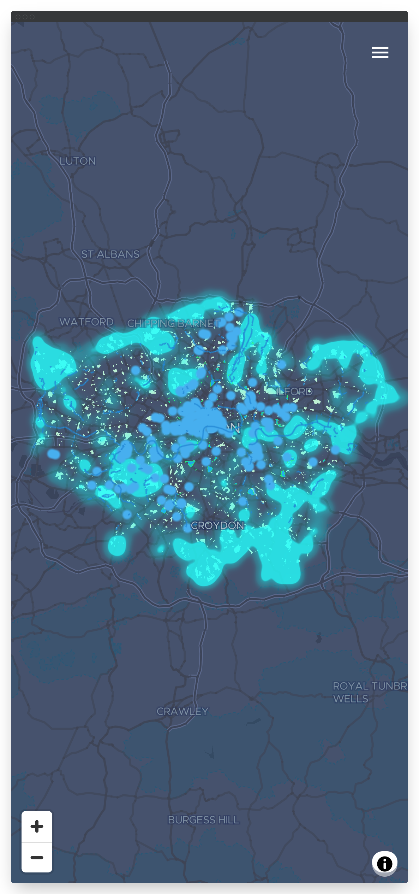

<p align="center">
  <a href="https://apps.london.gov.uk/gitea/gla-intelligence/cool-spaces">
    
  </a>

  <h3 align="center">LONDON'S COOL SPACES</h3>

  <p align="center">
    mapping the city's heatwave refuges
    <br />
    <a href="https://apps.london.gov.uk/cool-spaces/">View Site</a>
    ·
    <a href="https://apps.london.gov.uk/gitea/gla-intelligence/cool-spaces/issues">Report Bug</a>
    ·
    <a href="https://apps.london.gov.uk/gitea/gla-intelligence/cool-spaces/issues">Request Feature</a>
  </p>

## Table of contents

- [About The Project](#about-the-project)
  - [Built With](#built-with)
- [Client side](#client-side)
  - [Prerequisites](#prerequisites)
  - [Installation](#installation)
  - [Usage](#usage)
- [Data](#data)
  - [Tileserver](#tileserver)
- [Roadmap](#roadmap)
- [Contributing](#contributing)
- [License](#license)
- [Contact](#contact)
- [Acknowledgements](#acknowledgements)

## About The Project

[](https://apps.london.gov.uk/cool-spaces)

### Built with

- [node](https://nodejs.org/en/)
- [create-react-app](https://create-react-app.dev/)
- [gh-pages](https://github.com/tschaub/gh-pages)
- [material-ui](https://material-ui.com/)
- [maplibre-gl-js](https://github.com/maplibre/maplibre-gl-js)
- [postgis](https://postgis.net/)
- [tippecanoe](https://github.com/mapbox/tippecanoe)
- [tileserver-gl-light](https://www.npmjs.com/package/tileserver-gl-light)

## Browser side

To run this project from the frontend, connecting to the GLA api and database, you'll need nodejs for development, testing and building

### Prerequisites

- [nvm](https://github.com/nvm-sh/nvm#installing-and-updating)

  ```sh
  curl -o- https://raw.githubusercontent.com/nvm-sh/nvm/v0.37.2/install.sh | bash
  ```

- node
  ```sh
  nvm install node
  ```

### Installation

1. Clone the repo
   ```sh
   git clone https://apps.london.gov.uk/gitea/gla-intelligence/cool-spaces.git
   cd cool-spaces
   ```
2. Install NPM packages
   ```sh
   npm install
   ```

### Usage

#### Local development

##### Create-react-app

`create-react-app` bundles a webserver with live reloading so for development purposes you can run `npm start` then start working on the code and seeing the changes at http://localhost:3000

##### Maplibre

This map uses the community fork of Mapbox V1 - bindings for react were not released on the initial fork, but are on the roadmap

##### Design elements

Form elements used in this project are mainly from the [material-ui](https://material-ui.com/) library and provide keyboard operability and a high level of usability

The design additionally makes use of the [react-semantic-ui](https://react.semantic-ui.com/) placeholder components to show during asynchronous loading

##### Map legend colouring

An [observable notebook](https://observablehq.com/d/fd239fea18f1c574) used to explore the tree palette used in this map

#### Deployment

##### gh-pages (for test deployments)

`package.json` is configured to build and deploy to github-pages by specifying the `homepage` property, either as the full page url, e.g. `https://joelondon.github.io/cool-spaces` or as a dot

`package.json` includes the `deploy` and `pre-deploy` commands to trigger publication to github pages

```sh
npm run deploy
```

##### apps.london.gov.uk

To publish on `apps.london.gov.uk` simply commit the development work (i.e. js work in the `src` directory) and push to this repo's remote on that server - the `post-receive` git-hook will build the `public` directory and copy to the web root at `/cool-spaces`

#### React Tests

`npm test` launches the tests, which will run when the react bindings for `maplibre-gl-js` become available

## Data

The data is a merge of the current data release from GiGL with its predecessor.

The data is stored in Postgis and accessed via a tileserver

### Tileserver

We use `tileserver-gl-light` to provide the `.mbtiles` SQLite database

#### Getting the data from Postgis to .mbtiles via GeoJSON

Using `ogr2ogr` to get GeoJSON out of Postgis for .mbtiles creation via Tippecanoe

```
ogr2ogr -t_srs "EPSG:4326" -f GeoJSON -lco COORDINATE_PRECISION=5 avg-summer-temp-city-block.geojson "PG:host=3.11.224.244 dbname=gla_gis user=gisapdata password=gi\$own" -sql "select avglst, std_avglst, min_avglst, max_avglst, shape as geom FROM env_cs_average_summer_temperature_city_block"
```

#### Convert resulting GeoJSON into .mbtiles with Tippecanoe

```sh
tippecanoe \
 -o cool-spaces.mbtiles \
 --force \
 --maximum-zoom=16 \
 --minimum-zoom=4 \
 -r1 \
 --drop-densest-as-needed water-fountains.geojson watercourses.geojson borough-designated-cool-spaces.geojson other-public-shaded-green-areas.geojson


 tippecanoe \
 -o cool-spaces-avg-land-surface-temp.mbtiles \
 --force \
 --maximum-zoom=16 \
 --minimum-zoom=4 \
 -r1 \
 --drop-densest-as-needed avgLST_London_UrbanAtlas_hex_centroids.geojson

 tippecanoe \
 -o cool-spaces-avg-land-surface-hex.mbtiles \
 --force \
 --maximum-zoom=16 \
 --minimum-zoom=4 \
 -r1 \
 --drop-densest-as-needed avgLST_London_UrbanAtlas.geojson
```

#### Publish the tiles to the tileserver

GLA GIS maintain a separate [repository of tiles](https://apps.london.gov.uk/gitea/gla-intelligence/tileserver.git) that performs continuous deployment on uploaded tilesets/configs - _please note_ that the nginx config requires amending to allow `FileUpload` sizes that accomodate the size of `.mbtiles` being uploaded.

## Roadmap

See the [issues](https://apps.london.gov.uk/gitea/gla-intelligence/cool-spaces/issues) for a list of proposed features and known issues

## Contributing

Pull requests can be made as follows:

1. Fork the Project
2. Create your Feature Branch (`git checkout -b feature/AmazingFeature`)
3. Commit your Changes (`git commit -m 'Add some AmazingFeature'`)
4. Push to the Branch (`git push origin feature/AmazingFeature`)
5. Open a Pull Request

## License

Distributed under the GPLV3 License. See `LICENSE` for more information

## Contact

Joe Leach - joseph.leach@london.gov.uk

Project Link: [https://apps.london.gov.uk/gitea/gla-intelligence/cool-spaces](https://apps.london.gov.uk/gitea/gla-intelligence/cool-spaces)

## Acknowledgements

- [using gh-pages](https://medium.com/mobile-web-dev/how-to-build-and-deploy-a-react-app-to-github-pages-in-less-than-5-minutes-d6c4ffd30f14)

## Appendix

### User stories

as a council member of staff
i want bulk registration
so that i can submit multiple sites at once

as a gla member of staff
i want to provide info for residents to access cool spaces during a heatwave
so that the population can be protected

as a member of the public
i want to have an easy to access information
so that i can access a cool space during a heatwave

as a bloomberg consultant
i want to share gis intelligence (e.g. canopy cover, min/max temp)
so that i can help the gla to deliver the service
based on working on this in other cities

as a gla member of staff
i want to allocate registered cool spaces to tiers one, two and three
so that their utility can be assessed by the public

as someone with local knowledge
i want to be able to nominate a potential site
so that it can be considered by the steering group

as a member of gla gis team
i want to compile all the relevant data
so that i can map and label this
